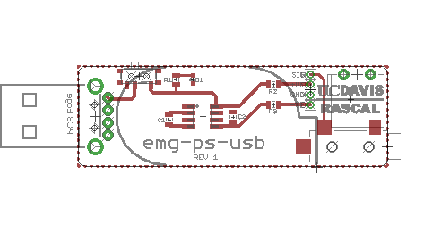

==========
emg-ps-usb
==========

Description
===========
This is a power supply design for powering Motion Lab Systems Y03 or Z03 EMG
preamplifiers with a standard USB port. The board is designed to function like
a USB dongle with EMG electrode leads coming from it and a 1/8" `TS phone
connector`_ output (e.g. to connect to a computer's microphone port).

It uses a charge pump voltage converter chip to generate -5V from +5V USB
power. It is recommended that the design in the current state be used only with
USB ports belonging to devices isolated from mains earth (ground). This is
because there is no galvanic isolation between the USB port's ground and the
ground electrode, which connects directly to the user. It was originally
designed to connect to Android tablets which have a full-size USB A jack and
a TRRS headset inputs.

Parts
=====
Integrated circuits:

* `Analog Devices ADM660`_ switched-capacitor voltage converter

Electromechanical:

* Apem MA12R/TR SPDT switch
* CUI MJ-3523-SMT 3.5mmm mono phono jack
* Molex 480390001 USB-A connector
* TE Connectivity 284093-2 2x1 screw terminal block
* MyCableMart.com 6" 3.5mm mono male to male cable

Discrete components:

* Samsung CL21A106KAYNNNE 10uF ceramic capcaitor
* Panasonic ERJ-6GEYJ101V 100 Ohm thick film resistor
* Panasonic ERJ-6GEYJ102V 1k Ohm thick film resistor
* OSRAM LS L29K-G1J2-1-Z red LED

Details, including vendor links and prices are in bill-of-materials.ods.

License
=======

The contents of this repository are licensed under the `CC-BY 4.0 license`_.

.. REFERENCES
.. _`Analog Devices ADM660`: http://www.analog.com/en/power-management/switched-capacitor-converters/adm660/products/product.html
.. _`TS phone connector`: https://en.wikipedia.org/wiki/Phone_connector_(audio)
.. _`CC-BY 4.0 license`: https://creativecommons.org/licenses/by/4.0/
